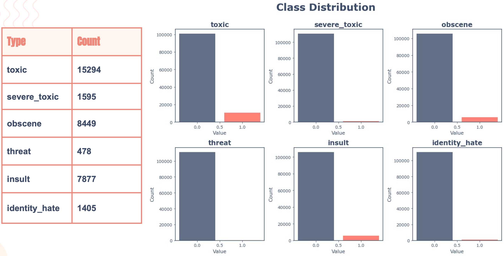
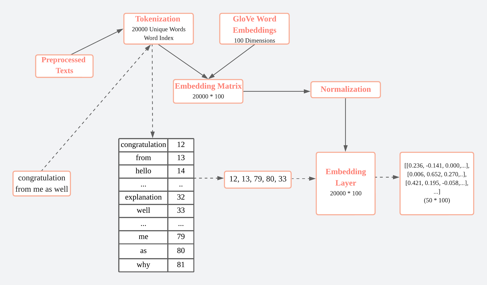
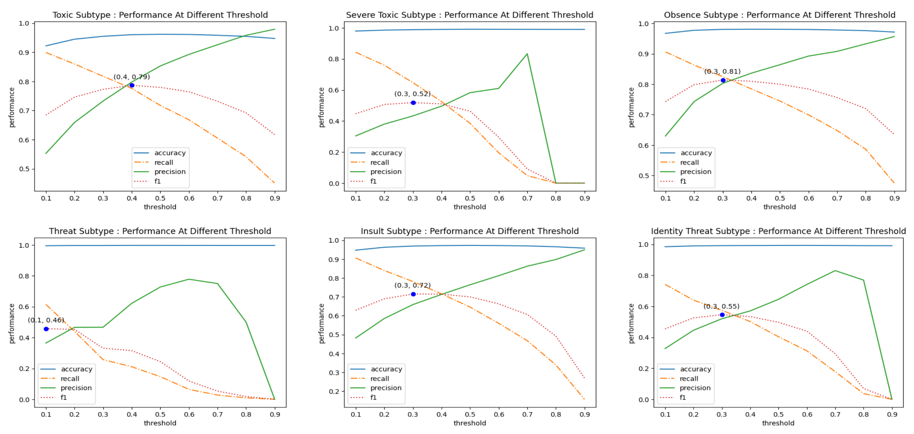
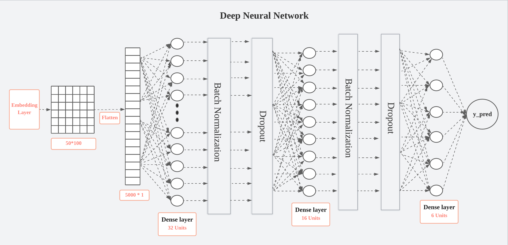
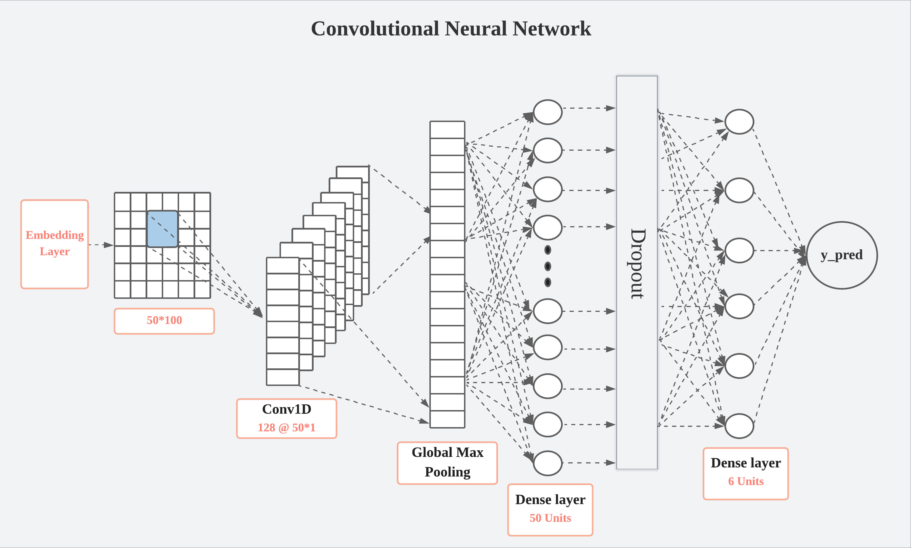
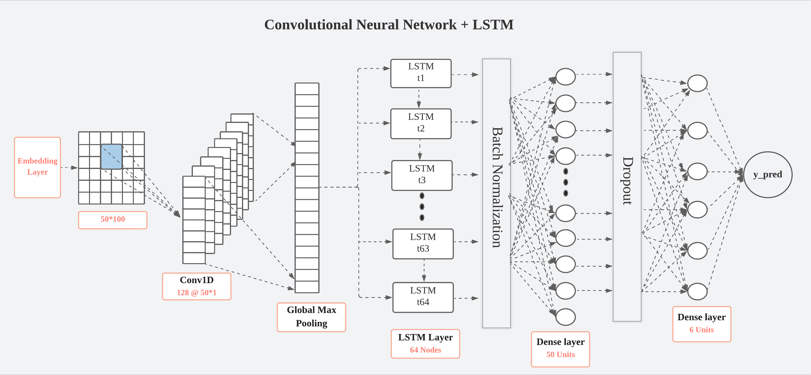
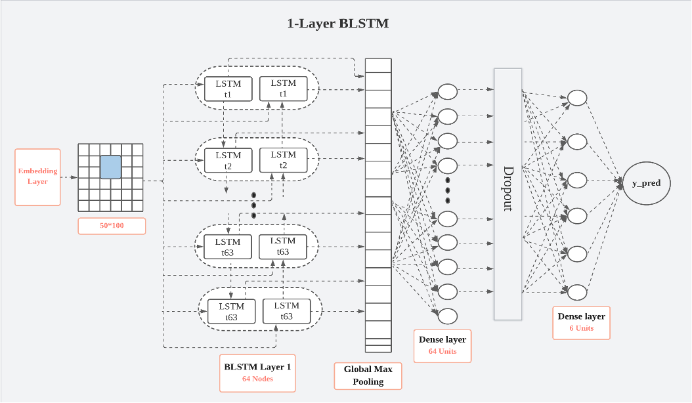
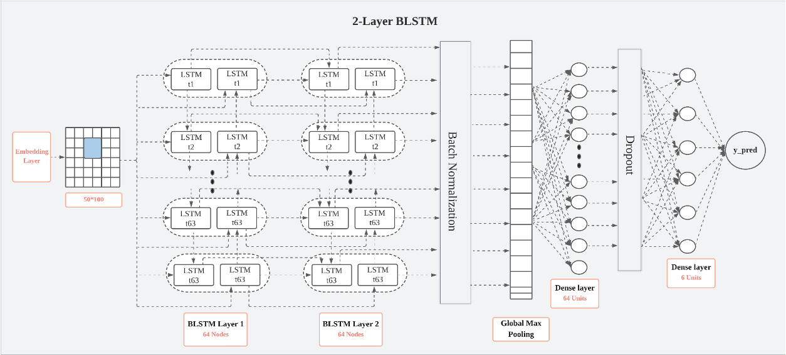
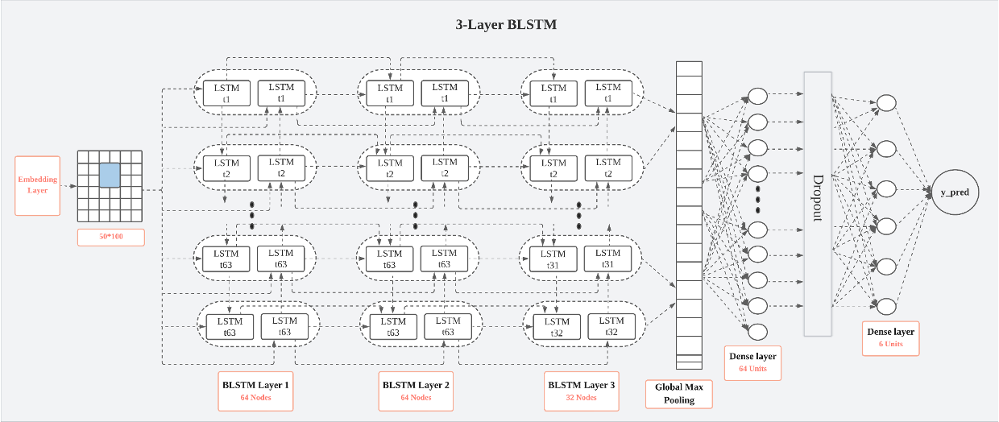
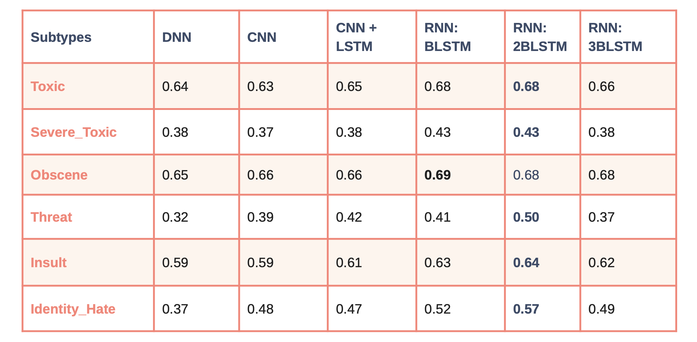

# Automated Content Moderation: NLP Against Toxic Comments

_Jiashu Chen, Qianqian Liu, Irene Yang, Chesie Yu_  

Efforts to mitigate the impact of toxic content have sparked significant interest in automated content moderation. The dissemination of social media content acts as a catalyst for the perpetuation and amplification of toxicity, reaching beyond the digital sphere. While existing research predominately focuses on identifying toxic content as a unified concept, this study investigates subcategories of toxicity using the Jigsaw toxic comment dataset. Employing pre-processed text and GloVe word embeddings, the work compared different variants and hybrids of deep learning models. Our findings reveal that the 2-layer BLSTM model outperforms other methods including DNN and CNN in F1 score. This approach achieved competitive results leveraging state-of-the-art RNN-based techniques.

## I. Introduction

### 1.1 Motivation
Toxic content is rampant on social media, posing far-reaching harm that extends beyond virtual boundaries. Such toxicity often perpetuates and amplifies as social media platforms broadcast their content to a wider audience. Content moderation thus holds significant implications in shaping the online community; social media companies like Meta or Twitter, despite their limited accountability under Section 230 of the Internet, need to act responsibly to provide a forum for free speech while ensuring proper use.  

Manual moderation, however, is infeasible due to the large scale and detrimental effect on human moderators. Automated content moderation, powered by deep learning and natural language processing, can scale these efforts in detection and prevention, fostering a safer and more inclusive online environment. Extensive research has thus been undertaken to develop automated text-based methods to mitigate offensive content, yet challenges remain in identifying the nuances of toxicity within user-generated content.

### 1.2 Research Objective
This study aims to tackle the challenge of multilabel toxic content detection by focusing on six subtypes of toxicity: toxic, severe toxic, obscenity, threat, insult, and identity hate. As toxicity can manifest in different forms, we hope to devise targeted interventions tailored to specific subtypes leveraging deep learning techniques. Through investigating and understanding the patterns of abusive language, we hope to combat cyberbullying and online hate speech.

## II. Related Work
The increasing propagation of hate speech sparked numerous efforts in finding effective countermeasures. Using various datasets and approaches, researchers have investigated the techniques for automated harmful content detection under various contexts. Waseem and Hovy (2016) examined character n-gram features for hate speech detection based on manually labeled tweets. Vigna et al. (2017) implemented SVM and LSTM for hate speech recognition on Facebook comments. Schmitt et al. (2017) investigated aspect-based sentiment analysis using LSTM and CNN. Kraus et al. (2019) proposed a tensor-based, tree-structured deep neural network, Discourse-LSTM, to learn the sentiment from rhetorical structures. While most of the existing automated solutions focus on detecting toxicity as a unified concept, our study will focus on the semantic detection of different subtypes of offensive content, as the next step in tackling the proliferation of online hate speech.

## III. Data

### 3.1 Data Source
This study uses the Jigsaw toxic comment data from Kaggle. Our training corpus consists of over 150,000 Wikipedia comments, pre-labeled to identify 6 subtypes of toxic behavior.  

Commonly observed in content moderation challenges, the data exhibits class imbalance with toxic comments representing the minority, particularly for threat and identity hate. Algorithms tend to overfit for majority class on such data, presenting a major challenge in model development. We will discuss the strategies to mitigate this bias and address potential limitations in subsequent sections.  

### 3.2 Data Processing 
- **Train-Dev-Test Split**: We first performed train-dev-test split to avoid overfiting.  Separate training and test sets were acquired from Kaggle.  We allocated 20% of the initial training data to create a development set for hyperparameter tuning and model selection.  The test set provided a final unbiased evaluation of model performance.  

- **Text Preprocessing**: To preserve the most relevant information for analysis, we implemented several preprocessing steps: tab and space removal, lowercase conversion, non-alphabets removal, POS tagging and lemmatization, and stopword removal.  Lemmatization was selected over stemming to avoid "over-stemming" problems, which reduced words to non-standard forms.   

- **Word Embeddings**: Using Keras tokenizer, we extracted 20,000 unique words from our preprocessed text based on frequency and assigned each word a unique index.  Subsequently, we downloaded the GloVe word embeddings and extracted the 100-dimensional word embeddings for each word.  This allowed us to create a 20,000 * 100 embedding matrix, which was normalized and used as the embedding layer, the first layer in all our neural network models.  

## IV. Methodology

### 4.1 Approach
Commonly used evaluation metrics such as accuracy are misleading for imbalanced data. To avoid over-optimistic assessments, we adopt a more robust evaluation approach that incorporates precision, recall, and F1 score. Precision and recall inform decision-making in targeted aspects: low precision restricts information access and free speech by systematically flagging harmless comments; low recall leads to proliferation of toxic hubs due to inability to capture toxicity. To strike the balance between the two, we therefore prioritize F1 score, the harmonic mean, as the key metric. We hope to achieve the optimal equilibrium between freedom of speech and safe online environment for users.   

### 4.2 Experiments
Using a comparative setting, we examine the performance of different neural network architectures on identical training, dev, and test sets in Google Colab. Each proposed model incorporates 100-dimensional embeddings as input and features a 6-unit dense layer with sigmoid activation for output. To account for class imbalance, we adjust the decision threshold for each subtype to optimize the F1 score, instead of using the default binary classification threshold 0.5. Models are validated on the dev set to determine the best-performing model in each category; hyperparameter tuning is performed using Keras random search tuner. Final evaluation of model effectiveness is carried out using the test set, consisting of 63,978 comments.  

Following this framework, we conduct six experiments as follows: DNN, CNN, CNN + LSTM, 1-Layer BLSTM, 2-Layer BLSTM, 3-Layer BLSTM.

- **Dense Neural Networks (DNN)**
  

- **Convolutional Neural Networks (CNN)**
  

- **Convolutional Neural Networks (CNN) + LSTM**
    

- **1-Layer Bidirectional LSTM (BLSTM)**
    

- **2-Layer Bidirectional LSTM (BLSTM)**
    

- **3-Layer Bidirectional LSTM (BLSTM)**
    

## V. Results

The table below summarizes the F1 scores for each subcategory across different models.  The 2-layer Bidirectional LSTM model outperformed others in F1 scores across almost all toxic subtypes, particularly in classes with severe imbalance.

We observed several trends from the experiment:

- **Higher Performance in Less Imbalanced Classes**  
    Overall, less imbalanced classes, such as toxic, obscene, and insult, achieved higher F1 scores than more imabalanced ones like severe toxic, threat, and identity hate.  Increased availability of training data enables models to capture class features more effectively, which in turn influences model performance across the six toxic subtypes.  

- **Limitations of DNN and CNN in Contextual Understanding**  
    DNN and CNN models demonstrated suboptimal performance in Experiments 1 and 2.  Toxic language can vary in expression, from subtle sarcasm to implicit insults, with meanings often dependent on context.  The absence of natural mechanism to capture word order makes DNNs less effective for such tasks.  CNNs, although effective at identifying local patterns, may struggle to recognize longer dependencies and contextual relationships.  

- **BLSTM Effectiveness at Detecting Minority Classes**  
    The BLSTM models outperformed CNN and DNN, with noticeable performance gains in minority classes such as severe toxic and identity hate.  These findings indicate that BLSTM may be more robust against class imbalance.  The bidirectional information flow in BLSTM improves its ability to understand sequential data, which is essential for capturing the nuances in natural language.  Further research, however, is needed to validate this observation.  

- **Overfitting Risk with Excessive BLSTM Layers**  
    While BLSTM models yielded better results, adding too many layers, as observed in Experiment 6, could result in overfitting.  The 3-layer BLSTM model consistently underperformed the 2-layer BLSTM under multiple hyperparameter settings, indicating it may be too complex for our dataset and prone to overfitting.  

Benchmarking our results against previous studies (Vigna et al., 2017; Schmitt et al., 2018), our pipeline demonstrated strong F1 scores in hate speech classification, despite relying on pre-trained instead of contextual embeddings.  

## VI. Discussion 

### Key Findings 

This study adds to the existing literature by focusing on the analysis of specific subtypes of toxic comments.  Our findings indicate that the 2-layer BLSTM model with batch normalization outperformed other models in multilabel classification tasks.  LSTM's ability to retain information over time makes it ideal for processing sequences of data with long-range dependencies as in NLP tasks.  On the other hand, DNN and CNN models demonstrated weaker performance, particularly in handling minority subtypes.  

It is important to note that LSTM models can be prone to overfitting.  We observed an increase in F1 scores when moving from a 1-layer to a 2-layer BLSTM, yet adding a third layer resulted in a performance drop.  Batch normalization proved effective in reducing overfitting and enabling faster convergence, thus improving model performance.  

### Ethical Considerations
Proliferation of harmful online content can lead to verbal abuse, cyberbullying, and a hostile environment that hinders open dialogue.  Automated content moderation initiatives like ours strive to reduce the prevalence of such negative interactions, empowering users to express their opinions without the fear of harassment.  

A critical consideration in our approach is balancing the trade-off between free speech and a safe environment.  Excessive content filtering can impede freedom of expression and limit access to valuable information.  While our model is designed to mitigate toxic behavior, we adopted a balanced approach to avoid inadvertently supressing legitimate discourse.  Models must be developed with fairness in mind, allowing diverse voices to be heard while protecting users from harmful content.  

## VII. Limitations and Future Work  

Our study has several imitations.  The dataset exhibited a significant class imbalance, with the toxic subtype representing only 10% of the comments and certain subtypes accounting for less than 1%.  While F1 scores were used to more accurately assess minority class performance, resampling techniques were not considered in this study.  Future work will explore methods like random undersampling, random oversampling, or SMOTE to address this imbalance.  

During the model development phase, we observed that the LSTM model demonstrated strong performance in detecting minority classes within the imbalanced dataset.  Furthur studies will aim to determine whether this performance stems from LSTM's effectiveness in learning from textual data or its inherent advantages in detecting minority classes.  

Lastly, real-world text data often include typos, misspellings, or slang that are absent in standard corpora, posing challenges for word embeddings.  A potential avenue for future research is to explore advanced techniques that can handle these out-of-vocabulary terms to 
improve model performance in applied settings.  

## VIII. Conclusion 
This study examines the performance of deep learning models in natural language processing on a highly-skewed, multilabel dataset. With extensive experiments, we demonstrate that 2-layer BLSTM outperforms DNN, CNN, hybrid CNN + LSTM, 1-layer and 3-layer BLSTM. This state-of-the-art RNN-based approach achieves competitive results in identifying toxic content, leveraging its ability to capture order dependence in sequential data. In our upcoming plan, we aim to explore sampling techniques to address class imbalance and handle out-of-vocabulary words from intentionally obfuscated content.

## References

Del Vigna12, F., Cimino23, A., Dell’Orletta, F., Petrocchi, M., & Tesconi, M. (2017, January). Hate me, hate me not: Hate speech detection on facebook. In Proceedings of the first Italian conference on cybersecurity (ITASEC17) (pp. 86-95).

Kraus, M., & Feuerriegel, S. (2019). Sentiment analysis based on rhetorical structure theory: Learning deep neural networks from discourse trees. Expert Systems with Applications, 118, 65-79.

Schmitt, M., Steinheber, S., Schreiber, K., & Roth, B. (2018). Joint Aspect and Polarity Classification for Aspect-based Sentiment Analysis with End-to-End Neural Networks. In Proceedings of the 2018 Conference on Empirical Methods in Natural Language Processing (pp. 1109-1114).

Waseem, Z., & Hovy, D. (2016, June). Hateful symbols or hateful people? predictive features for hate speech detection on twitter. In Proceedings of the NAACL student research workshop (pp. 88-93).

